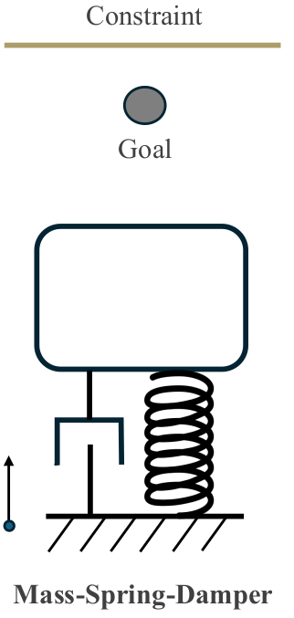
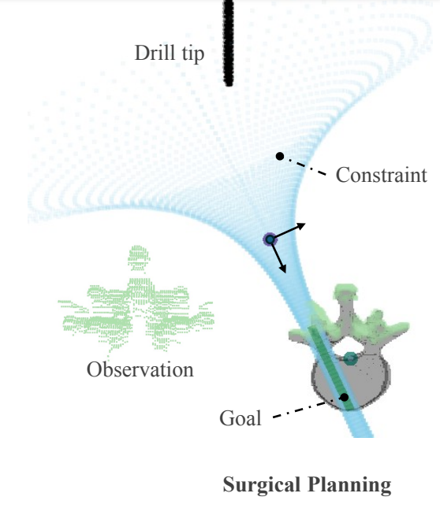

# Stochastic MPC for Sub-Gaussian Noise

Official implementation of **Stochastic Model Predictive Control for Sub-Gaussian Noise** (https://arxiv.org/abs/2503.08795)

<p float="center">
  
  
</p>

## Installation

### Python packages
    conda create -n subgau python=3.9
    pip install -r requirements.txt
    conda install -c conda-forge scikit-geometry

### Acados for MPC (https://docs.acados.org/installation/index.html)
Clone the C++ repo of acados:

    git clone https://github.com/acados/acados.git
    cd acados
    git submodule update --recursive --init

Build the acados:

    mkdir -p build
    cd build
    cmake -DACADOS_WITH_QPOASES=ON ..
    # add more optional arguments e.g. -DACADOS_WITH_OSQP=OFF/ON -DACADOS_INSTALL_DIR=<path_to_acados_installation_folder> above
    make install -j4

Install acados python package:

    pip install -e <acados_root>/interfaces/acados_template

Add path to environment variables:

    export LD_LIBRARY_PATH=$LD_LIBRARY_PATH:"<acados_root>/lib"
    export ACADOS_SOURCE_DIR="<acados_root>"

Test with examples:

    python <acados_root>/examples/acados_python/getting_started/minimal_example_ocp.py


### Testing

Calibrate variance proxies from data:

    python main_calibration.py

Run experiment for uncertainty propagation, comparing robust, distributional robust (DR) and sub-Gaussian approaches:

    python main_propagation.py

Run DR and robust MPC with 2D visualization for surgical planning environment:

    python main_control_2d.py

Run DR and sub-Gaussian MPC with mass-spring-damper environment with 1D visualization:

    python main_control_classic.py

The resulting visualization figures are saved under ```/images```
